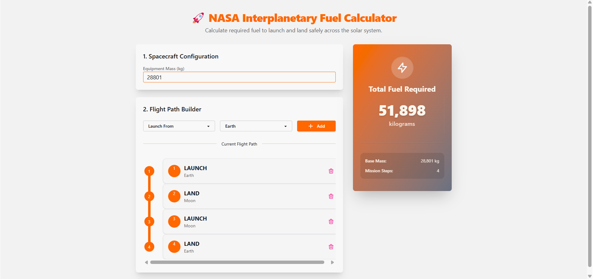

# 🚀 NASA Interplanetary Fuel Calculator



Welcome to the **NASA Interplanetary Fuel Calculator**! This project is an advanced web application built to calculate the exact amount of fuel required for spacecraft to launch and land safely across different planets in the solar system.

This application was developed as a solution to a Full-Stack Engineering challenge, prioritizing clean architecture, highly testable backend logic, and a dynamic real-time user interface.

## ✨ Features

* **Dynamic Flight Path Builder**: Users can sequentially add flight steps (Launch or Land) for Earth, Moon, and Mars.
* **Real-Time Fuel Calculation**: As soon as the spacecraft mass or the flight path changes, the total fuel required is recalculated instantly via WebSockets, providing a seamless user experience.
* **Cascading Fuel Weight Logic**: The backend logic accurately accounts for the fact that *fuel adds weight to the ship*. It tail-recursively calculates the additional fuel required to carry the fuel itself until the additional amount hits zero.
* **Sleek & Modern UI**: A responsive, dark-mode-first aesthetic using **Tailwind CSS** and **DaisyUI**, ensuring the interface feels as advanced as a real NASA dashboard.

## 🛠️ Technology Stack

* **Language:** Elixir (v1.17)
* **Framework:** Phoenix (v1.8-rc) & Phoenix LiveView
* **Frontend:** Tailwind CSS & DaisyUI
* **Testing:** ExUnit (Built-in Elixir testing framework)

## 🏗️ Architecture

The project strictly follows a clean architecture model:
1. **Core Logic (`Interplanetary.FuelCalculator`)**: A pure Elixir module isolated from the web layer. It handles the mathematical calculations recursively.
2. **Web Layer (`FuelCalculatorWeb.CalculatorLive`)**: A LiveView component that manages the state (spacecraft mass, selected steps) and reacts to UI events instantly without full page reloads.

## 🚀 How to Run Locally

### Prerequisites
* [Elixir](https://elixir-lang.org/install.html) ~> 1.15
* Erlang/OTP ~> 24

### Setup

1. Clone this repository:
   ```bash
   git clone https://github.com/your-username/nasa-fuel-calculator.git
   cd nasa-fuel-calculator
   ```

2. Install Elixir dependencies:
   ```bash
   mix deps.get
   ```

3. Start the Phoenix server:
   ```bash
   mix phx.server
   ```
   *You can also run it interactively with `iex -S mix phx.server`.*

4. Access the application in your browser at:
   👉 **[http://localhost:4000](http://localhost:4000)**

## 🧪 Running Tests

The core mathematical logic is fully covered by unit tests that validate real-world scenarios (like the Apollo 11 Mission and Mars Missions).

To run the test suite:
```bash
mix test
```

## 📝 Example Scenarios Validated

- **Apollo 11 Mission**: Launch Earth, Land Moon, Launch Moon, Land Earth (Mass: 28801 kg) ➡️ **51,898 kg fuel**
- **Mars Mission**: Launch Earth, Land Mars, Launch Mars, Land Earth (Mass: 14606 kg) ➡️ **33,388 kg fuel**
- **Passenger Ship**: Launch Earth, Land Moon, Launch Moon, Land Mars, Launch Mars, Land Earth (Mass: 75432 kg) ➡️ **212,161 kg fuel**

---
*Built with ❤️ for interplanetary exploration.*
